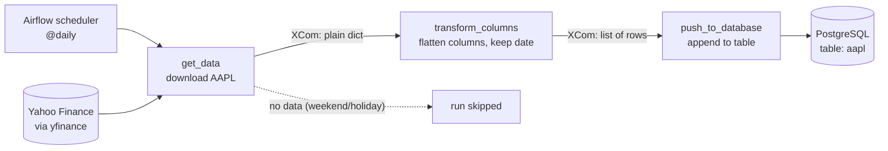

# AAPL Stock Data Pipeline (Airflow + Postgres + Docker)

A small ETL pipeline that runs once a day: it downloads Apple (AAPL) stock prices from Yahoo Finance, reshapes them with pandas, and appends them to a PostgreSQL table. It is orchestrated by Apache Airflow, and every component runs in Docker.

I built it to learn how Airflow orchestrates a workflow: tasks, dependencies, scheduling, passing data between tasks, and connecting containers.

## Pipeline overview



| Task | What it does |
|------|--------------|
| `get_data` | Downloads the latest daily price data for AAPL with `yfinance`. If Yahoo returns nothing (weekends, market holidays), the run is marked as **skipped**, not failed. Returns the data as plain lists and numbers. |
| `transform_columns` | Rebuilds a pandas DataFrame, flattens the `(price, ticker)` column pairs into names like `Close_AAPL`, and turns the date index into a normal column. |
| `push_to_database` | Rebuilds the DataFrame, converts the date column, and appends the rows to the `aapl` table in Postgres with SQLAlchemy. |


## Architecture

Two containers on one user-defined Docker network, so they can reach each other by container name:

```
+---------------------------+          +---------------------------+
|  Airflow (standalone)     |          |  PostgreSQL 13            |
|  scheduler + web UI       | -------> |  table: aapl              |
|  DAG: aapl_pipeline       |  :5432   |                           |
+---------------------------+          +---------------------------+
        Docker network (user-defined bridge)
```

## Tech stack

- Apache Airflow 3 (TaskFlow API, `airflow.sdk`)
- Python 3.13 (from the official Airflow image)
- yfinance, pandas, SQLAlchemy, psycopg 3
- PostgreSQL 13
- Docker

## Data model

Table `aapl`, one row per trading day:

| Column | Description |
|--------|-------------|
| `Date` | Trading day |
| `Close_AAPL`, `High_AAPL`, `Low_AAPL`, `Open_AAPL` | Daily prices |
| `Volume_AAPL` | Shares traded |


## Known limitations and next steps

- **Duplicate rows:** the load uses `append`, so re-running the DAG for the same day inserts the same row again. Planned fix: make the load idempotent (unique constraint on `Date` plus upsert, or delete-then-insert).
- **Credentials:** the database connection string is currently hardcoded in the DAG file. Planned: move it to an Airflow Connection or environment variable, and never commit real credentials.
- **No data-quality checks or alerting** yet.

