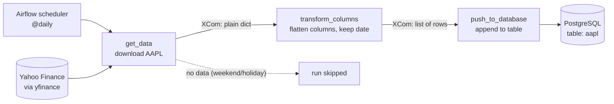

# AAPL Stock Data Pipeline (Airflow + Postgres + Docker)

A small ETL pipeline that runs once a day: it downloads Apple (AAPL) stock prices from Yahoo Finance, reshapes them with pandas, and appends them to a PostgreSQL table. It is orchestrated by Apache Airflow, and every component runs in Docker.

I built it to learn how Airflow orchestrates a workflow: tasks, dependencies, scheduling, passing data between tasks, and connecting containers.

## Pipeline overview



| Task | What it does |
|------|--------------|
| `get_data` | Downloads the latest daily price data for AAPL with `yfinance`. If Yahoo returns nothing (weekends, market holidays), the run is marked as **skipped**, not failed. Returns the data as plain lists and numbers. |
| `transform_columns` | Rebuilds a pandas DataFrame, flattens the `(price, ticker)` column pairs into names like `Close_AAPL`, and turns the date index into a normal column. |
| `push_to_database` | Rebuilds the DataFrame, converts the date column, and appends the rows to the `aapl` table in Postgres with SQLAlchemy. |

### Passing data between tasks

Airflow tasks run as separate processes, so they can't share Python variables. A task's return value is stored as an **XCom** (in Airflow's metadata database) and handed to the next task. XComs must be JSON-serializable, so DataFrames are converted to plain dicts and lists before a task returns, and rebuilt at the start of the next one. This is fine for one row a day. For larger data, a task would write to a file or storage and pass only the location.

## Architecture

Two containers on one user-defined Docker network, so they can reach each other by container name:

```
+---------------------------+          +---------------------------+
|  Airflow (standalone)     |          |  PostgreSQL 13            |
|  scheduler + web UI       | -------> |  table: aapl              |
|  DAG: aapl_pipeline       |  :5432   |                           |
+---------------------------+          +---------------------------+
        Docker network (user-defined bridge)
```

## Tech stack

- Apache Airflow 3 (TaskFlow API, `airflow.sdk`)
- Python 3.13 (from the official Airflow image)
- yfinance, pandas, SQLAlchemy, psycopg 3
- PostgreSQL 13
- Docker

## Data model

Table `aapl`, one row per trading day:

| Column | Description |
|--------|-------------|
| `Date` | Trading day |
| `Close_AAPL`, `High_AAPL`, `Low_AAPL`, `Open_AAPL` | Daily prices |
| `Volume_AAPL` | Shares traded |

## Setup

Assumes Docker is installed. Replace the angle-bracket placeholders with your own values.

1. **Create a network** for the containers:
   ```bash
   docker network create <network-name>
   ```

2. **Start Postgres** on that network:
   ```bash
   docker run -d --name <postgres-container> --network <network-name> \
     -e POSTGRES_PASSWORD=<password> -p 5432:5432 postgres:13
   ```

3. **Start Airflow** on the same network, mounting the DAG, log and plugin folders:
   ```bash
   docker run -d --name <airflow-container> --network <network-name> \
     -p 8080:8080 \
     -v "$PWD/dags:/opt/airflow/dags:z" \
     -v "$PWD/logs:/opt/airflow/logs:z" \
     -v "$PWD/plugins:/opt/airflow/plugins:z" \
     apache/airflow airflow standalone
   ```

4. **Install the extra Python packages** in the Airflow container (the base image doesn't include them):
   ```bash
   docker exec -it <airflow-container> python -m pip install yfinance "psycopg[binary]"
   ```

5. **Add the DAG** file to `dags/`, set the Postgres host in the connection URL to `<postgres-container>` (the container name, port 5432), then open http://localhost:8080. The admin password is printed in the Airflow container logs (`docker logs <airflow-container>`).

6. **Unpause** `aapl_pipeline` and trigger a run. Then check the data:
   ```bash
   docker exec -it <postgres-container> psql -U postgres -c 'SELECT * FROM aapl;'
   ```

### Troubleshooting notes

- **Container can't reach Postgres:** `localhost` inside a container means the container itself. Use the Postgres container's name as the host, and make sure both containers are on the same user-defined network.
- **DAG doesn't appear / `Permission denied` on the DAG file (Fedora, SELinux):** the mounted folder needs the `:z` option so SELinux relabels it for containers.
- **Tasks fail within seconds ("state mismatch" in the audit log):** the `logs/` folder on the host must be writable by the container's user.
- **`pip` fails with "Permission denied" in the container:** run it as `python -m pip ...`.

## Known limitations and next steps

- **Duplicate rows:** the load uses `append`, so re-running the DAG for the same day inserts the same row again. Planned fix: make the load idempotent (unique constraint on `Date` plus upsert, or delete-then-insert).
- **Credentials:** the database connection string is currently hardcoded in the DAG file. Planned: move it to an Airflow Connection or environment variable, and never commit real credentials.
- **Single ticker:** AAPL only. Planned: make the ticker list configurable.
- **Local-only setup:** `airflow standalone` uses SQLite and runs all components in one process. A production-style setup would use Docker Compose with separate services and Postgres as Airflow's metadata database.
- **Manual package install:** the extra packages are lost when the container is recreated. Planned: a small custom Docker image with them baked in.
- **No data-quality checks or alerting** yet.

